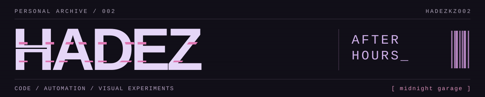
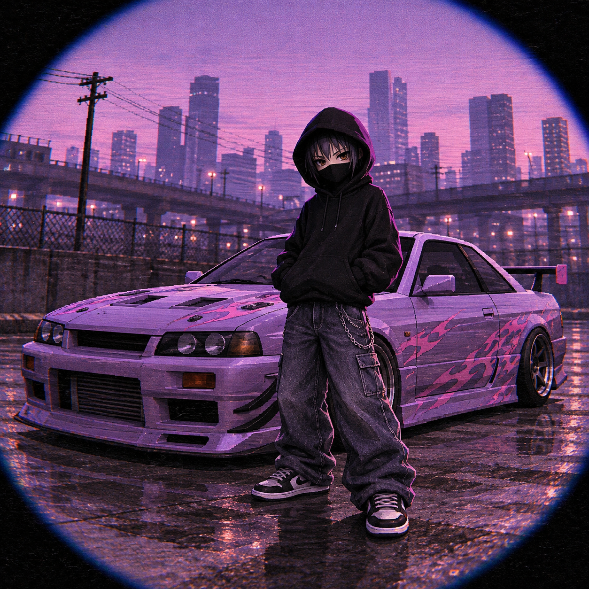

<!-- 1:6 7:2 1:12 7:10 7:9 8:14 7:17 5:4 -->
<p align="center">
  
</p>



<br>

<samp>$ whoami</samp>

### Builds web apps.<br>Automates the repetitive parts.<br>Cares how things look and feel.

<samp>full-stack / ai workflows / visual experiments</samp>

<br clear="all">
<br>

```
guest@hadez:~$ cat /etc/motd

            .         .
             _.-----._
         (@)=( . : . )=(@)
             '-.___.-'
  _..--"""--..|▓▓▓▓▓|..--"""--.._
.'░░░░░▒▒▒▒▒▒▒[▓▓X▓▓]▒▒▒▒▒▒▒░░░░░'.
'-._░░░▒▒▒_..-|▓▓▓▓▓|-.._▒▒▒░░░_.-'
    ""-..-""  \▓▓3▓▓/  ""-..-""
    .-'░▒▒'-.  |▓3▓|  .-'▒▒░'-.
    '-.░▒▒.-'  |▓0▓|  '-.▒▒░.-'
               '.1.'
                 V

guest@hadez:~$ finger hadez
Login: hadezkz002     Name: Hadez
Project: you ran the key.
Plan:
  typescript   react     next.js
  python       fastapi   node.js
  postgresql   docker    git

guest@hadez:~$ cat ~hadez/.signal
WMNJX YJABA VTJVB ZXYJX NMIKJ
FGKPV RMAZG FQWAI LRWIP ZIIYP
RHEES MEYTV QTFOX CTERX GRXMV
ZWYFB JUJZA MFOBZ YTVYX VSBBU
RVCWE CLRYG BAWVJ QGJMM NLRYX
NT

guest@hadez:~$ ls ~hadez/signal
0x01.wav
0x02.pub
0x03.png -> (sleeping)
0x04.gif -> (sleeping)

guest@hadez:~$ █
```

<!-- slot:0x03 -->

<!-- slot:0x04 -->

<br>

<p align="center">
  <sub><samp>bGVzcyBub2lzZS4gbW9yZSBpbnRlbnQu</samp></sub><br>
  <sub>the puzzles are original. the cicada and 3301 are a nod to puzzle culture — no affiliation.</sub>
</p>
